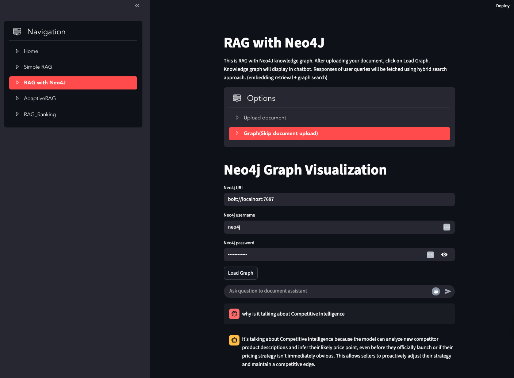

# RAG Application

This project is a Streamlit application that showcases and compares different Retrieval-Augmented Generation (RAG) techniques for building an interactive chatbot that can answer questions based on your uploaded documents. 

-----

### Features

  * **Simple RAG**: A foundational RAG implementation using a simple vector store (**FAISS**) for document retrieval. It's a great starting point to understand the RAG workflow.
  * **RAG with Neo4j**: An advanced approach that leverages a **Neo4j knowledge graph** to enhance document retrieval. It uses a hybrid search to combine the power of vector embeddings with structured graph data.
  * **Adaptive RAG**: A sophisticated strategy powered by **Langgraph** that dynamically analyzes user queries to determine the optimal retrieval path, offering a more intelligent and flexible RAG pipeline.
  * **RAG with Reranking**: Improves the quality of retrieved documents by using a **Cohere Rerank** model to reorder search results, ensuring the most relevant information is presented to the LLM for a more accurate response.

---

### Demo



-----

### Technologies Used

  * **Streamlit**: For building the interactive web application user interface.
  * **LangChain**: The framework for orchestrating the RAG pipelines, handling document loading, splitting, and conversational chains.
  * **FAISS**: An efficient library for vector similarity search, used as the primary vector store.
  * **Groq**: The LLM provider (**Llama3-70b-8192**) used for generating responses.
  * **Neo4j**: An open-source graph database for the knowledge graph implementation.
  * **HuggingFace Embeddings**: For converting text into dense vector representations.
  * **Cohere Rerank**: A powerful reranking model to improve the relevance of retrieved documents.

-----

### Prerequisites

  * **Python 3.8+**: The project is built with Python.
  * **Neo4j Desktop or Server**: Required for the "RAG with Neo4j" feature. You must also install the **APOC plugin** and enable `apoc.*` procedures in `neo4j.conf`.
  * **API Keys**: You will need API keys for Groq and Cohere.

-----

### Setup and Installation

1.  **Clone the repository**:

    ```bash
    git clone <repository-url>
    cd <repository-name>
    ```

2.  **Create a virtual environment**:

    ```bash
    python -m venv venv
    source venv/bin/activate  # On Windows, use `venv\Scripts\activate`
    ```

3.  **Install dependencies**:

    ```bash
    pip install -r requirements.txt
    ```

    *(Note: You will need to create a `requirements.txt` file by listing all the imported libraries in the code.)*

4.  **Configure API Keys**:
    Create a `.env` file in the root directory and add your API keys:

    ```
    GROQ_API_KEY="your_groq_api_key"
    COHERE_API_KEY="your_cohere_api_key"
    ```

5.  **Neo4j Setup (Optional)**:
    If you plan to use the Neo4j feature, ensure your Neo4j database is running and accessible with the correct credentials. The application assumes the default bolt URI (`bolt://localhost:7687`) and `neo4j` as the username. You can modify this in the code if needed.

-----

### Usage

To run the application, simply execute the following command from the project's root directory:

```bash
streamlit run main.py
```

This will launch the Streamlit application in your web browser. You can then navigate between the different RAG modes using the sidebar.